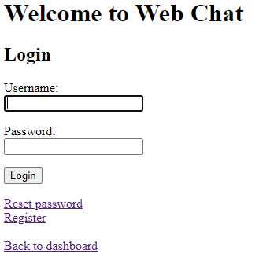
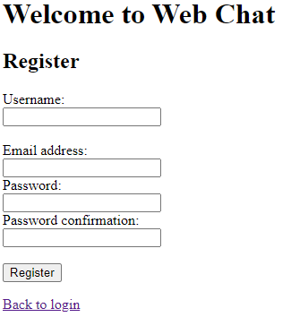
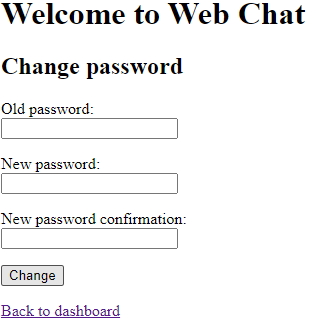
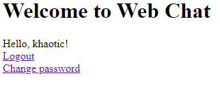
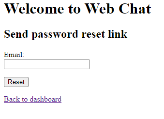
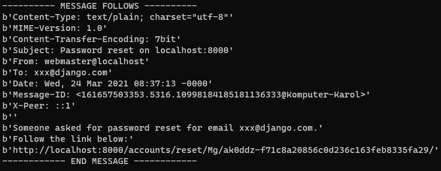
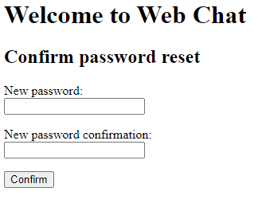

# Webchat Projekt Skryptowy

Serwis webowy w formie chatu internetowego do, którego można się zarejestrować i rozmawiać z innymi użytkownikami serwisu. Aplikacja operuje na pokojach do których można dołączyć lub tworzyć własne i rozmawiać w kilka osób. W serwisie będzie można zmienić swoje zdjęcie, nick, email oraz hasło. 

Technologie wykorzystane do projektu:
- Backend: Python, Django, Sqlite
- Frontend: HTML, CSS, Bootstrap, JavaScript

# I Raport 26.03.2021
Na obecną chwilę zaimplementowałem bazę danych i system użytkowników. W systemie użytkowników działa już logowanie, wylogowywanie, zmiana hasła, resetowanie hasła (jeśli się je zapomniało po przez email z linkiem do strony gdzie można nadać nowe hasło) oraz rejestracja w serwisie.

Logowanie:  

Rejestracja:  

Zmiana hasła:  

Wylogowywanie:  

Reset zapomnianego hasła:  
  

# Do Zrobienia
- system chatowania (tworzenie i dołączanie do chatów, rozmowy)
- dodanie automatycznego dodawania nowych wiadomości bez odświeżania strony
- możliwość zmiany emaila i zdjęcia
- nadanie wyglądu aplikacji przez CSS i Bootstrap
